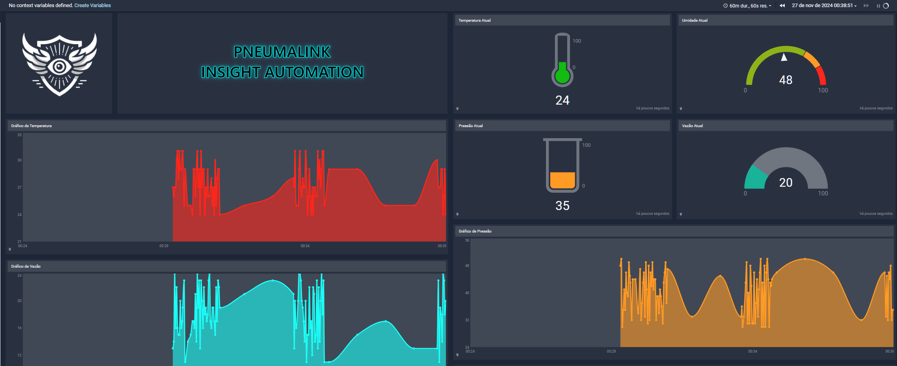
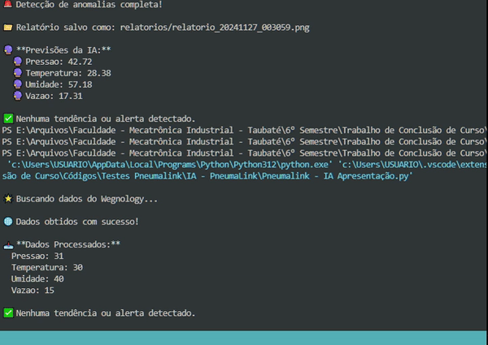

# 📊 Pneumalink — Sistema de Monitoramento Industrial Inteligente

**Projeto de Conclusão de Curso — Tecnólogo em Mecatrônica Industrial**  
**Autores:** Leandro Augusto Leite Chaves Mo e Rodrigo Oliveira Vilalta

---

## 📌 Sobre o Projeto

O **Pneumalink** é um protótipo de sistema de monitoramento industrial desenvolvido como parte do projeto de conclusão do curso de Tecnólogo em Mecatrônica Industrial. O projeto foi idealizado com o objetivo de oferecer uma solução acessível para pequenas e médias empresas, permitindo a supervisão eficiente de variáveis industriais e a redução de downtime em linhas de produção.

Este repositório foi criado para apresentar publicamente a documentação e os conceitos do projeto, **não incluindo o código-fonte por questões de privacidade acadêmica e direitos autorais**.

---

## 📈 Funcionalidades do Sistema

- **Monitoramento de variáveis industriais**: pressão, temperatura, umidade e vazão.
- **Detecção de anomalias e alertas em tempo real**.
- **Previsão de falhas baseada em dados históricos via algoritmos de Machine Learning**.
- **Notificações automáticas via SMS** utilizando a API Twilio.
- **Relatórios e dashboards intuitivos** para tomada de decisão.

---

## ⚙️ Tecnologias e Ferramentas Utilizadas

- **ESP32 - Utilizando o Arduino IDE**
- **MQTT (Wegnology)**
- **Python (Machine Learning e Análise de Dados)**
- **Twilio API para envio de notificações**
- **Dashboards Web (Wegnology)**

---

## 📊 Como Funciona

O Pneumalink foi projetado para coletar dados de sensores industriais conectados a um ESP32, que envia as informações do Arduino IDE via MQTT para a nuvem (Wegnology). Os dados são processados por scripts Python responsáveis pela análise e detecção de padrões anômalos, também atualiza os dashboards de monitoramento em tempo real. Caso necessário, o sistema aciona notificações automáticas por SMS.

Fluxo resumido:
1. Coleta de dados pelos sensores das máquinas
2. Processamento local no ESP32
3. Envio de dados para a nuvem (Wegnology)
4. Análise com IA em Python
5. Emissão de alertas e exibição de relatórios
6. Ação corretiva ou manutenção preventiva

---

## 🖥️ Demonstrações e Imagens

> 📄 [Apresentação Completa Pitch Talk](https://www.canva.com/design/DAGBIVKwHz0/-7eVF7sJizAyGELyxBg5Sg/view?utm_content=DAGBIVKwHz0&utm_campaign=designshare&utm_medium=link2&utm_source=uniquelinks&utlId=hcc9a4e5775)

Imagens do sistema em operação:

- 📊 Dashboard em Tempo Real (Simulação)

- 📈 Gráficos de Tendência

- 📡 Monitoramento Remoto

---

## 📝 Roadmap de Expansão (Futuro)

- Implementação de banco de dados SQL para registro histórico.
- Desenvolvimento de dashboard proprietário sem dependência de terceiros.
- Ampliação do envio de alertas via WhatsApp e Telegram.
- Aprimoramento dos algoritmos de Machine Learning.
- Integração completa com sistemas SCADA.

---

## 📄 Licença

Este projeto e todo o conteúdo disponível neste repositório estão licenciados sob os termos da **Creative Commons Attribution-NonCommercial-NoDerivatives 4.0 International (CC BY-NC-ND 4.0)**.

Você pode:
- Compartilhar — copiar e redistribuir o material em qualquer formato ou meio.

Sob as seguintes condições:
- **Atribuição** — Deve dar o crédito apropriado, fornecer um link para a licença e indicar se alterações foram feitas.
- **Não Comercial** — Não pode usar o material para fins comerciais.
- **Sem Derivações** — Não pode modificar ou adaptar o conteúdo.

**⚠️ O código-fonte deste projeto não está incluso por questões de privacidade acadêmica e propriedade intelectual.**

Leia mais sobre a licença em: [https://creativecommons.org/licenses/by-nc-nd/4.0/](https://creativecommons.org/licenses/by-nc-nd/4.0/)

---

## 📬 Contatos

**Leandro Augusto Leite Chaves Mo**
📧 leandrochaves.1@hotmail.com

**Rodrigo Oliveira Vilalta**  
📧 rodrigo.vilalta.0305@gmail.com  

---
